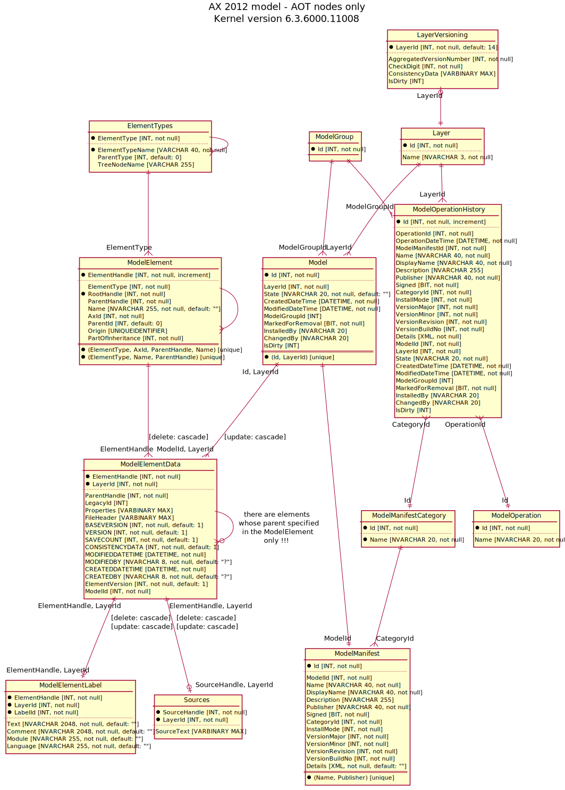
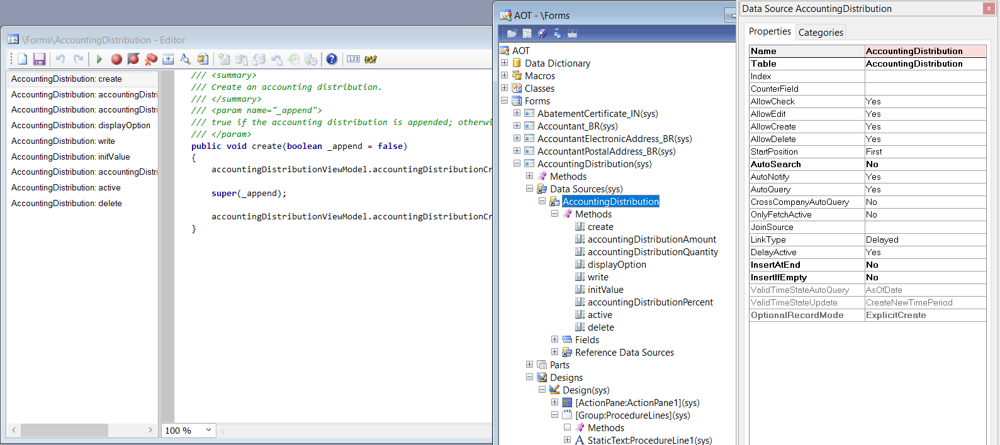
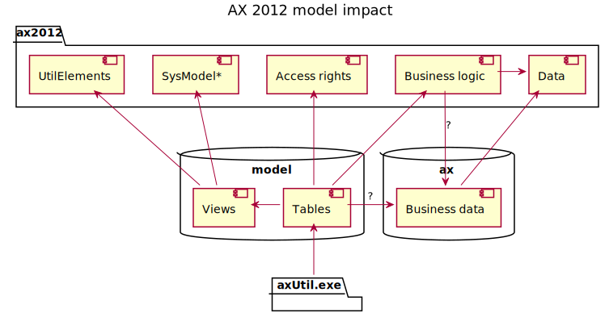
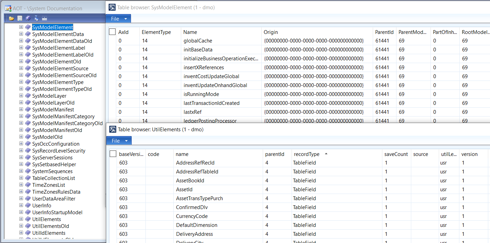

# ax2012-model-erd

[project]:https://github.com/mazzy-ax/ax2012-model-erd
[license]:https://github.com/mazzy-ax/ax2012-model-erd/blob/master/LICENSE

Microsoft Dynamics AX 2012 хранит объекты бизнес-логики в отдельной базе данных MS SQL &ndash; в базе данных моделей (model database).

[ax2012-model-erd][project] &ndash; это [диаграмма](model.plantuml) основных таблиц и их связей в базе данных модели.

## ERD

Исходный код диаграммы: [model.plantuml](model.plantuml)

## Объекты бизнес-логики в Аксапте

Аксапта предоставляет человеку дерево АОТ для взаимодействия с объектами бизнес-логики. Каждый узел дерева содержит свойства или код на языке X++.

В базе данных моделей каждый узел дерева АОТ хранится как запись в таблицах ModelElement и ModelElementData.

Традиционно, Аксапта предоставляет несколько специализированных классов для доступа к объектам АОТ из кода на языке X++. Но кроме этого, в AX 2012 пробрасывает данные из базы данных моделей внутрь приложения (System Documentation\Tables) в таблицы семейства `SysModel*` и view `UtilIdElements`, `UtilElements`.

Поэтому код X++ может получить доступ к объектам бизнес-логики как к обычным таблицам, не обращаясь к внешней базе.

## Как получить исходный код объектов model database

Исходный код объектов model database можно получить двумя способами:

1. Непосредственно открыть базу данных модели в [Microsoft SQL Management Studio](https://docs.microsoft.com/en-us/sql/ssms/sql-server-management-studio-ssms)
1. [Импортировать новый проект в Visual Studio](https://docs.microsoft.com/en-us/sql/ssdt/how-to-create-a-new-database-project)

Исходный код и свойства всех объектов базы данных модели, за исключением четырех (см. ниже), открыт и доступен для анализа.

## Зашифрованные объекты в model database

AX 2012 model database содержит 4 зашифрованных объекта, которые вы не сможете ни модифировать, ни получить их исходный код штатными средствами. Так при создании проекта, Visual Studio выдает следующие предупреждения:

* Warning: [dbo].[LicenseCodes]: The body was not imported because it is encrypted.
* Warning: [dbo].[ConfigurationKeys]: The body was not imported because it is encrypted.
* Warning: [dbo].[XU_ValidateConfigKeyAndLicenseCodeIntegrity]: The body was not imported because it is encrypted.
* Warning: [dbo].[XU_GetDirtyFlag]: The body was not imported because it is encrypted.
* For more information about encrypted objects in SSDT see https://go.microsoft.com/fwlink/?LinkID=238374&clcid=0x409

> Примечание: Страница по ссылке не открывается. Помню, что там было написано, что данный способ сокрытия информации не рекомендуется Майкрософтом, поскольку не защищает от просмотра данных в обход SQL сервера, непосредственно в файловой системе. Сам я никогда не пытался выяснить что находится к этих объектах, поскольку не предполагаю, что эти зашифрованные объекты влияют на работу бизнес-логики AX 2012 после ввода валидных лицензионных ключей.

## Disclaimer и необходимые предупреждения

В данном проекте не исследуются, не рассматриваются и не публикуются зашифрованные объекты базы данных модели.

В данном проекте не рассматриваются таблицы и view, которые реализуют:

* права доступа к бизнес-объектам
* импорт/экспорт моделей
* диагностику и исправление внутренних идентикаторов элементов модели
* тип для передачи типизированных параметров в хранимых процедурах и функциях

В рамках данного проекта в диаграмму включены только таблицы, которые хранят объекты бизнес-логики в AX 2012 R3.

В рамках данного проекта рассматривался код model database для разных версий AX 2012 R3. Однако опубликована ERD по состоянию на Kernel version 6.3.6000.11008 (самые последние обновления, которые я нашел).

Обратите внимание, что 12 октября 2021 года Microsoft [прекратил основную фазу поддержки](https://docs.microsoft.com/en-us/lifecycle/products/dynamics-ax-2012-r3) AX 2012 R3. Расширенная поддержка будет прекращена 10 января 2023 года. Это значит, что Microsoft не выпускает публичные обновления к этому продукту. Однако Microsoft может выпустить обновления для тех заказчиков, которые оплатили расширенную поддержку.

## Помощь проекту

Буду признателен вашим замечания, предложения и советы по проекту в разделе [Issues](https://github.com/mazzy-ax/ax2012-model-erd/issues).

Мазуркин Сергей (mazzy)